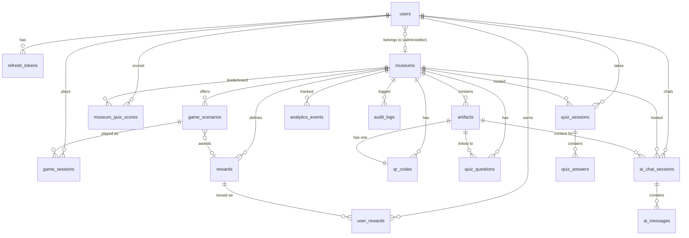

# MuseumQuest — Database Schema

**Version:** 1.0
**Last Updated:** 2026-03-28
**Source:** PRD v1.0 (Section 12)
**Engine:** PostgreSQL 16 (AWS RDS, Multi-AZ)
**Extensions:** pgvector, pg_trgm, TimescaleDB

---

## Overview

- **17 tables** in the initial schema
- **Soft-delete convention:** All tables include `created_at`, `updated_at`, and `deleted_at` (nullable) unless noted otherwise
- **Multi-tenant isolation:** All tenant-scoped tables have a `museum_id` FK with B-Tree index
- **ORM:** Prisma (parameterized queries only — raw SQL prohibited)
- **Migrations:** Prisma Migrate (version-controlled, CI-friendly)

---

## Entity-Relationship Diagram



---

## Table Definitions

### 1. `users`

| Column | Type | Constraints | Notes |
|---|---|---|---|
| `id` | UUID | PK, DEFAULT gen_random_uuid() | |
| `email` | VARCHAR(255) | UNIQUE, NOT NULL | B-Tree index |
| `password_hash` | VARCHAR(255) | Nullable | NULL for Google OAuth accounts |
| `display_name` | VARCHAR(50) | NOT NULL | XSS sanitized on write |
| `avatar_url` | VARCHAR(500) | Nullable | S3 CDN URL |
| `role` | ENUM(`user`, `content_editor`, `museum_admin`, `super_admin`) | NOT NULL, DEFAULT `user` | |
| `museum_id` | UUID | FK → `museums.id`, Nullable | Set for `content_editor`, `museum_admin`. NULL for `user`, `super_admin`. |
| `total_points` | INTEGER | NOT NULL, DEFAULT 0 | Denormalized global XP. Per-museum ranking uses `museum_quiz_scores`. |
| `preferences` | JSONB | NOT NULL, DEFAULT `'{}'` | See JSONB schema below |
| `date_of_birth` | DATE | NOT NULL | Collected for future age-gate `[MVP-STUB]` |
| `is_banned` | BOOLEAN | NOT NULL, DEFAULT false | |
| `created_at` | TIMESTAMPTZ | NOT NULL, DEFAULT NOW() | |
| `updated_at` | TIMESTAMPTZ | NOT NULL | |
| `deleted_at` | TIMESTAMPTZ | Nullable | Soft-delete. 30-day grace → hard-delete PII. |

**`users.preferences` JSONB Schema:**

```json
{
  "language": "tr",
  "preferredDifficulty": "medium",
  "accessibility": {
    "reducedMotion": false,
    "highContrast": false
  }
}
```

---

### 2. `refresh_tokens`

| Column | Type | Constraints | Notes |
|---|---|---|---|
| `jti` | UUID | PK | JWT ID — unique per token |
| `user_id` | UUID | FK → `users.id`, NOT NULL | |
| `token_hash` | VARCHAR(64) | NOT NULL | SHA-256 hash of raw refresh token |
| `device_hint` | VARCHAR(255) | Nullable | User-Agent or device identifier |
| `expires_at` | TIMESTAMPTZ | NOT NULL | 7 days from issuance |
| `is_revoked` | BOOLEAN | NOT NULL, DEFAULT false | |
| `created_at` | TIMESTAMPTZ | NOT NULL, DEFAULT NOW() | |

**Constraint:** Only 1 active (non-revoked, non-expired) refresh token per user. New issuance revokes all previous.

---

### 3. `museums`

| Column | Type | Constraints | Notes |
|---|---|---|---|
| `id` | UUID | PK | |
| `name` | VARCHAR(200) | NOT NULL | |
| `slug` | VARCHAR(200) | UNIQUE, NOT NULL | URL-friendly identifier |
| `description` | TEXT | | |
| `logo_url` | VARCHAR(500) | Nullable | |
| `address` | JSONB | NOT NULL | `{ street, city, country, lat, lng }` |
| `settings` | JSONB | NOT NULL, DEFAULT `'{}'` | See full JSONB schema below |
| `is_active` | BOOLEAN | NOT NULL, DEFAULT **false** | SaaS entitlement toggle. Museums start inactive; `super_admin` must explicitly enable after setup. |
| `created_at` | TIMESTAMPTZ | NOT NULL, DEFAULT NOW() | |
| `updated_at` | TIMESTAMPTZ | NOT NULL | |
| `deleted_at` | TIMESTAMPTZ | Nullable | |

**`museums.settings` JSONB Schema:**

```json
{
  "theme": {
    "primaryColor": "#1E40AF",
    "secondaryColor": "#F59E0B",
    "logoUrl": "https://cdn.example.com/logo.png"
  },
  "ai_config": {
    "personaName": "Museum Guide",
    "systemPromptOverride": null,
    "isEnabled": true
  },
  "modules": {
    "quizEnabled": true,
    "treasureHuntEnabled": true,
    "aiAssistantEnabled": true
  },
  "limits": {
    "maxAnswerAttemptsPerClue": 3,
    "hintsPerClue": 1,
    "hintRevealOnAttempt": 2,
    "gameSessionTimeoutHours": 4,
    "quizTimerSeconds": 30,
    "maxAiTurnsPerSession": 5,
    "aiRateLimitPerMinute": 3,
    "questionsPerQuizByDifficulty": { "easy": 10, "medium": 15, "hard": 20 },
    "pointsPerCorrectByDifficulty": { "easy": 10, "medium": 20, "hard": 30 },
    "gameClueTimerSeconds": 60,
    "timeBonusEnabled": true,
    "timeBonusMax": 10,
    "maxFinalCodeAttempts": 5
  }
}
```

> ⚙️ All `limits` values seeded on museum creation, modifiable by `museum_admin` via `PATCH /api/v1/museums/:id`.

---

### 4. `artifacts`

| Column | Type | Constraints | Notes |
|---|---|---|---|
| `id` | UUID | PK | |
| `museum_id` | UUID | FK → `museums.id`, NOT NULL | B-Tree index |
| `name` | VARCHAR(300) | NOT NULL | |
| `description` | TEXT | | |
| `historical_context` | TEXT | | |
| `period` | VARCHAR(100) | Nullable | e.g., "Late Bronze Age" |
| `media_urls` | JSONB | DEFAULT `'[]'` | `[{ url, type, variant }]` |
| `audio_guide_url` | VARCHAR(500) | Nullable | CDN URL |
| `audio_transcript` | TEXT | Nullable | |
| `location_hint` | VARCHAR(300) | Nullable | e.g., "Room 3, East Wall" |
| `embedding` | vector(1536) | Nullable | pgvector for RAG. IVFFlat index. |
| `metadata` | JSONB | DEFAULT `'{}'` | Dimensions, material, provenance |
| `suggested_questions` | JSONB | DEFAULT `'[]'` | Admin-defined AI questions. `string[]` |
| `created_at` | TIMESTAMPTZ | NOT NULL, DEFAULT NOW() | |
| `updated_at` | TIMESTAMPTZ | NOT NULL | |
| `deleted_at` | TIMESTAMPTZ | Nullable | |

**Indexes:**
- `idx_artifacts_museum_id` — B-Tree on `museum_id`
- `idx_artifacts_embedding` — IVFFlat (pgvector) for cosine similarity
- `idx_artifacts_search` — GIN (pg_trgm) on `name`, `description`

---

### 5. `qr_codes`

| Column | Type | Constraints | Notes |
|---|---|---|---|
| `id` | UUID | PK | |
| `museum_id` | UUID | FK → `museums.id`, NOT NULL | |
| `artifact_id` | UUID | FK → `artifacts.id`, NOT NULL | |
| `code_hash` | VARCHAR(128) | UNIQUE, NOT NULL | HMAC payload hash. B-Tree index. |
| `kid` | VARCHAR(50) | NOT NULL | Key ID for HMAC secret version |
| `image_url` | VARCHAR(500) | NOT NULL | S3 URL of QR PNG |
| `scan_count` | INTEGER | NOT NULL, DEFAULT 0 | Denormalized counter |
| `is_active` | BOOLEAN | NOT NULL, DEFAULT true | |
| `created_at` | TIMESTAMPTZ | NOT NULL, DEFAULT NOW() | |
| `updated_at` | TIMESTAMPTZ | NOT NULL | |

---

### 6. `game_scenarios`

| Column | Type | Constraints | Notes |
|---|---|---|---|
| `id` | UUID | PK | |
| `museum_id` | UUID | FK → `museums.id`, NOT NULL | |
| `title` | VARCHAR(300) | NOT NULL | |
| `story_intro` | TEXT | NOT NULL | Narrative shown at game start |
| `difficulty` | ENUM(`easy`, `medium`, `hard`) | NOT NULL | |
| `status` | ENUM(`draft`, `published`) | NOT NULL, DEFAULT `draft` | Only `published` visible to visitors |
| `clues` | JSONB | NOT NULL, DEFAULT `'[]'` | See clue schema below |
| `final_code` | VARCHAR(50) | NOT NULL | Code to enter after all clues |
| `reward_id` | UUID | FK → `rewards.id`, Nullable | Reward on completion |
| `created_at` | TIMESTAMPTZ | NOT NULL, DEFAULT NOW() | |
| `updated_at` | TIMESTAMPTZ | NOT NULL | |
| `deleted_at` | TIMESTAMPTZ | Nullable | |

**`game_scenarios.clues[]` JSONB Schema:**

```json
{
  "clueIndex": 0,
  "narrativeText": "Follow the path of the ancient pharaoh...",
  "locationHint": "Room 3, East Wall — near the stone tablet",
  "artifactId": "uuid",
  "qrCodeId": "uuid",
  "question": {
    "text": "What dynasty does this sarcophagus belong to?",
    "options": [
      { "text": "18th Dynasty", "isCorrect": true },
      { "text": "19th Dynasty", "isCorrect": false },
      { "text": "20th Dynasty", "isCorrect": false },
      { "text": "21st Dynasty", "isCorrect": false }
    ],
    "hintText": "Look at the cartouche on the base."
  }
}
```

**Rules:** `clueIndex` sequential from 0. Exactly one option with `isCorrect: true`. Points come from `museums.settings.limits`, not stored per clue.

---

### 7. `game_sessions`

| Column | Type | Constraints | Notes |
|---|---|---|---|
| `id` | UUID | PK | |
| `user_id` | UUID | FK → `users.id`, Nullable | NULL for guest sessions |
| `guest_token_jti` | VARCHAR(128) | Nullable | Guest JWT jti. Nullified on account link. |
| `scenario_id` | UUID | FK → `game_scenarios.id`, NOT NULL | |
| `state` | ENUM(`IDLE`, `CLUE_ACTIVE`, `QR_SCANNED`, `ANSWER_SUBMITTED`, `CORRECT`, `INCORRECT`, `FINAL_CODE`, `COMPLETED`, `EXPIRED`) | NOT NULL, DEFAULT `IDLE` | |
| `current_clue_index` | INTEGER | NOT NULL, DEFAULT 0 | |
| `score` | INTEGER | NOT NULL, DEFAULT 0 | |
| `attempts_on_current_clue` | INTEGER | NOT NULL, DEFAULT 0 | Resets on clue advance |
| `completed_at` | TIMESTAMPTZ | Nullable | |
| `created_at` | TIMESTAMPTZ | NOT NULL, DEFAULT NOW() | |
| `updated_at` | TIMESTAMPTZ | NOT NULL | |

**Index:** Composite on `(user_id, state)` for active session lookups.

---

### 8. `quiz_questions`

| Column | Type | Constraints | Notes |
|---|---|---|---|
| `id` | UUID | PK | |
| `museum_id` | UUID | FK → `museums.id`, NOT NULL | |
| `artifact_id` | UUID | FK → `artifacts.id`, Nullable | Optional link to artifact |
| `question_text` | TEXT | NOT NULL | |
| `options` | JSONB | NOT NULL | `[{ "text": string, "isCorrect": boolean }]` |
| `explanation` | TEXT | Nullable | Shown after answering |
| `difficulty` | ENUM(`easy`, `medium`, `hard`) | NOT NULL | |
| `status` | ENUM(`draft`, `published`) | NOT NULL, DEFAULT `draft` | Only `published` selected for sessions |
| `created_at` | TIMESTAMPTZ | NOT NULL, DEFAULT NOW() | |
| `updated_at` | TIMESTAMPTZ | NOT NULL | |
| `deleted_at` | TIMESTAMPTZ | Nullable | |

---

### 9. `quiz_sessions`

| Column | Type | Constraints | Notes |
|---|---|---|---|
| `id` | UUID | PK | |
| `user_id` | UUID | FK → `users.id`, Nullable | Nullable for anonymization on hard-delete |
| `museum_id` | UUID | FK → `museums.id`, NOT NULL | |
| `difficulty` | ENUM(`easy`, `medium`, `hard`) | NOT NULL | |
| `total_score` | INTEGER | NOT NULL, DEFAULT 0 | |
| `questions_answered` | INTEGER | NOT NULL, DEFAULT 0 | |
| `correct_count` | INTEGER | NOT NULL, DEFAULT 0 | |
| `completed_at` | TIMESTAMPTZ | Nullable | |
| `created_at` | TIMESTAMPTZ | NOT NULL, DEFAULT NOW() | |
| `updated_at` | TIMESTAMPTZ | NOT NULL | |

---

### 10. `quiz_answers`

| Column | Type | Constraints | Notes |
|---|---|---|---|
| `session_id` | UUID | FK → `quiz_sessions.id` | **Composite PK** |
| `question_id` | UUID | FK → `quiz_questions.id` | **Composite PK** |
| `selected_option` | INTEGER | NOT NULL | Index of selected option (-1 for timeout) |
| `is_correct` | BOOLEAN | NOT NULL | |
| `points_earned` | INTEGER | NOT NULL | Base + time bonus |
| `time_spent_ms` | INTEGER | NOT NULL | Client-reported, server-validated |
| `answered_at` | TIMESTAMPTZ | NOT NULL, DEFAULT NOW() | |

**Index:** B-Tree on `session_id`

---

### 11. `museum_quiz_scores`

Per-museum leaderboard. One row per (user, museum). Stores personal best.

| Column | Type | Constraints | Notes |
|---|---|---|---|
| `id` | UUID | PK | |
| `user_id` | UUID | FK → `users.id`, Nullable | Nullable for anonymization |
| `museum_id` | UUID | FK → `museums.id`, NOT NULL | |
| `best_score` | INTEGER | NOT NULL | Updated via UPSERT only if new > existing |
| `quiz_count` | INTEGER | NOT NULL, DEFAULT 1 | Incremented per completion |
| `last_played_at` | TIMESTAMPTZ | NOT NULL | |

**Constraint:** UNIQUE on `(user_id, museum_id)` (partial: where `user_id IS NOT NULL`)

---

### 12. `ai_chat_sessions`

| Column | Type | Constraints | Notes |
|---|---|---|---|
| `id` | UUID | PK | |
| `user_id` | UUID | FK → `users.id`, NOT NULL | |
| `museum_id` | UUID | FK → `museums.id`, NOT NULL | |
| `artifact_context_id` | UUID | FK → `artifacts.id`, Nullable | If set, artifact metadata auto-injected into prompts |
| `created_at` | TIMESTAMPTZ | NOT NULL, DEFAULT NOW() | |
| `updated_at` | TIMESTAMPTZ | NOT NULL | |

---

### 13. `ai_messages`

| Column | Type | Constraints | Notes |
|---|---|---|---|
| `id` | UUID | PK | |
| `session_id` | UUID | FK → `ai_chat_sessions.id`, NOT NULL | |
| `role` | ENUM(`user`, `assistant`) | NOT NULL | |
| `content` | TEXT | NOT NULL | |
| `tokens_used` | INTEGER | NOT NULL, DEFAULT 0 | For cost tracking |
| `flag_status` | ENUM(`unflagged`, `flagged`, `dismissed`) | NOT NULL, DEFAULT `unflagged` | `[MVP-STUB]` |
| `created_at` | TIMESTAMPTZ | NOT NULL, DEFAULT NOW() | |

**Retention:** Hard-delete messages older than 7 days (scheduled job).
**Index:** B-Tree on `created_at` (for retention cleanup).

---

### 14. `rewards`

| Column | Type | Constraints | Notes |
|---|---|---|---|
| `id` | UUID | PK | |
| `museum_id` | UUID | FK → `museums.id`, NOT NULL | |
| `name` | VARCHAR(200) | NOT NULL | e.g., "Pharaoh Explorer Badge" |
| `type` | ENUM(`badge`, `certificate`, `discount_code`) | NOT NULL | |
| `asset_url` | VARCHAR(500) | Nullable | Badge/certificate image URL |
| `description` | TEXT | Nullable | |
| `trigger_type` | ENUM(`game_completion`, `quiz_threshold`) | NOT NULL | Defines when the reward is issued |
| `trigger_config` | JSONB | NOT NULL, DEFAULT `'{}'` | Trigger-specific config. See schema below. |
| `linked_scenario_id` | UUID | FK → `game_scenarios.id`, Nullable | Required when `trigger_type = game_completion` |
| `discount_validity_days` | INTEGER | Nullable | Days until discount code expires after issuance. NULL = never expires. |
| `created_at` | TIMESTAMPTZ | NOT NULL, DEFAULT NOW() | |
| `updated_at` | TIMESTAMPTZ | NOT NULL | |
| `deleted_at` | TIMESTAMPTZ | Nullable | |

**`rewards.trigger_config` JSONB Schema:**

For `trigger_type = game_completion`:
```json
{}
```
> Reward is issued when the linked scenario is completed. No additional config needed.

For `trigger_type = quiz_threshold`:
```json
{
  "minScore": 80,
  "difficulty": "medium"
}
```
> `minScore` (required): Minimum quiz score to earn the reward. `difficulty` (optional): Only trigger for quizzes of this difficulty. NULL = any difficulty.

---

### 15. `user_rewards`

| Column | Type | Constraints | Notes |
|---|---|---|---|
| `id` | UUID | PK | |
| `user_id` | UUID | FK → `users.id`, NOT NULL | |
| `reward_id` | UUID | FK → `rewards.id`, NOT NULL | |
| `discount_code` | VARCHAR(8) | UNIQUE, Nullable | 8-char uppercase alphanumeric. Only for `discount_code` type. |
| `is_redeemed` | BOOLEAN | NOT NULL, DEFAULT false | For discount codes |
| `earned_via` | JSONB | NOT NULL | `{ "type": "treasure_hunt" | "quiz", "sessionId": "uuid" }` |
| `expires_at` | TIMESTAMPTZ | Nullable | For discount codes: `issued_at + rewards.discount_validity_days`. NULL = never expires. |
| `issued_at` | TIMESTAMPTZ | NOT NULL, DEFAULT NOW() | |

**Constraint:** UNIQUE on `(user_id, reward_id)` — prevents duplicate badge issuance.
**Discount Code Verification:** Must check both `is_redeemed = false` AND (`expires_at IS NULL OR expires_at > NOW()`).

---

### 16. `analytics_events`

| Column | Type | Constraints | Notes |
|---|---|---|---|
| `id` | UUID | PK | |
| `museum_id` | UUID | FK → `museums.id`, Nullable | NULL for platform-level events |
| `user_id_hash` | VARCHAR(128) | Nullable | Salted HMAC hash — NOT a direct FK |
| `event_type` | VARCHAR(100) | NOT NULL | e.g., `qr_scan_success` |
| `payload` | JSONB | DEFAULT `'{}'` | Event-specific data |
| `occurred_at` | TIMESTAMPTZ | NOT NULL, DEFAULT NOW() | TimescaleDB hypertable partition column |

**TimescaleDB:** Created as hypertable partitioned by `occurred_at`. Continuous aggregates for daily/weekly rollups.
**Retention:** 12 months. Older partitions auto-dropped.
**Privacy:** `user_id_hash` is pseudonymized HMAC — KVKK/GDPR compliant.

---

### 17. `audit_logs`

| Column | Type | Constraints | Notes |
|---|---|---|---|
| `id` | UUID | PK | |
| `actor_id` | UUID | FK → `users.id`, NOT NULL | Who performed the action |
| `actor_role` | VARCHAR(50) | NOT NULL | Role at time of action |
| `action` | VARCHAR(100) | NOT NULL | e.g., `artifact.deleted`, `user.role_changed` |
| `target_type` | VARCHAR(50) | NOT NULL | e.g., `artifact`, `user`, `museum` |
| `target_id` | UUID | NOT NULL | ID of affected entity |
| `metadata` | JSONB | DEFAULT `'{}'` | e.g., `{ "oldRole": "user", "newRole": "content_editor" }` |
| `museum_id` | UUID | Nullable | NULL for system-wide actions |
| `ip_address` | INET | NOT NULL | |
| `created_at` | TIMESTAMPTZ | NOT NULL, DEFAULT NOW() | |

**IMMUTABLE:** No UPDATE or DELETE operations permitted. Append-only.
**Index:** Composite B-Tree on `(museum_id, created_at)`

**Auditable Events:**
- `artifact.created`, `artifact.updated`, `artifact.deleted`
- `user.role_changed`, `user.banned`, `user.deleted`
- `museum.created`, `museum.updated`, `museum.disabled`, `museum.enabled`
- `game_scenario.published`, `game_scenario.deleted`
- `quiz_question.published`, `quiz_question.deleted`
- `reward.created`, `reward.deleted`
- `qr_code.deactivated`

---

## Index Summary

| Table | Index | Type | Purpose |
|---|---|---|---|
| `users` | `email` | UNIQUE B-Tree | Login lookup |
| `artifacts` | `museum_id` | B-Tree | Tenant-scoped queries |
| `artifacts` | `embedding` | IVFFlat (pgvector) | RAG similarity search |
| `artifacts` | `name, description` | GIN (pg_trgm) | Fuzzy text search |
| `qr_codes` | `code_hash` | UNIQUE B-Tree | Instant scan validation (< 200ms p95) |
| `game_sessions` | `(user_id, state)` | Composite B-Tree | Active session lookup |
| `quiz_answers` | `session_id` | B-Tree | Session answer retrieval |
| `museum_quiz_scores` | `(user_id, museum_id)` | UNIQUE | Leaderboard upsert |
| `analytics_events` | `occurred_at` | TimescaleDB hypertable | Time-series partitioning |
| `audit_logs` | `(museum_id, created_at)` | Composite B-Tree | Admin log filtering |
| `ai_messages` | `created_at` | B-Tree | Retention job cleanup |

---

## Data Retention Policies

| Data | Retention | Mechanism |
|---|---|---|
| `analytics_events` | 12 months | TimescaleDB auto-drops old partitions |
| `ai_messages` | 7 days | Scheduled Bull job hard-deletes |
| Deleted user PII | 30-day grace → hard-delete | Scheduled Bull job |
| Game sessions | Indefinite | Scores preserved for lifetime analytics |
| Quiz sessions | Indefinite | Scores preserved for lifetime analytics |
| Audit logs | Indefinite (Phase 1) | Retention policy TBD Phase 2 |

---

## PII Hard-Delete Procedure (30-day Post Soft-Delete)

When a user's `deleted_at` exceeds 30 days:

1. **Purge from `users`:** Remove `email`, `display_name`, `avatar_url`, `password_hash`, `preferences` (or delete row)
2. **Delete `ai_messages`** where `session.user_id` = user
3. **Delete `ai_chat_sessions`** for user
4. **Anonymize game/quiz:** Set `user_id = NULL` on `game_sessions`, `quiz_sessions`, `quiz_answers`, `museum_quiz_scores`
5. **Remove Redis leaderboard entries** from sorted sets
6. **Delete `user_rewards`** entries
7. **Log** deletion event in `audit_logs`

---

## Multi-Tenant Isolation

Every table with a `museum_id` column is tenant-scoped. The `MuseumTenantMiddleware` ensures:

- All repository queries include `WHERE museum_id = :museumId`
- Admin roles resolve `museumId` from JWT claim, never from request body
- Cross-museum queries forbidden except `super_admin` analytics
- RLS (database-level) deferred to Phase 2

**Tenant-scoped tables:** `artifacts`, `qr_codes`, `game_scenarios`, `game_sessions` (via scenario), `quiz_questions`, `quiz_sessions`, `ai_chat_sessions`, `rewards`, `user_rewards` (via reward), `analytics_events`, `audit_logs`

---

*End of database.md*
