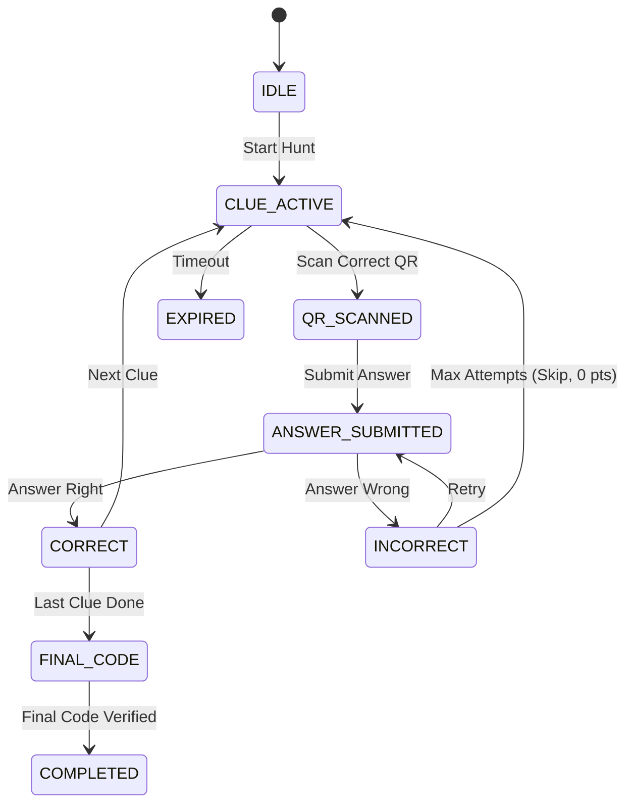

# UC-GAME — Treasure Hunt Game Engine

---

## State Machine

---

## Gameplay

### UC-GP01: Start a Treasure Hunt
**Actor:** Visitor (guest or authenticated)  
**Precondition:** A published scenario exists for the museum.  
**Main Flow:**
1. Visitor selects a scenario and starts the hunt.
2. System creates a game session and presents the story intro.
3. First clue (narrative + location hint) is revealed.
**Exceptions:**
- Visitor already has an active session → must complete or wait for timeout.

---

### UC-GP02: Scan Clue QR Code
**Actor:** Visitor (session owner)  
**Precondition:** Visitor is in CLUE_ACTIVE state.  
**Main Flow:**
1. Visitor navigates to the artifact and scans its QR code.
2. System validates the scan against the expected clue.
3. State transitions to QR_SCANNED; question is revealed.
**Exceptions:**
- Wrong QR code scanned → counted as an incorrect attempt.

---

### UC-GP03: Answer Correctly
**Actor:** Visitor (session owner)  
**Precondition:** Visitor is in QR_SCANNED state.  
**Main Flow:**
1. Visitor submits the correct answer.
2. Points are awarded (base + time bonus if applicable).
3. Next clue is unlocked, or FINAL_CODE if last clue.
**Exceptions:**
- None.

---

### UC-GP04: Answer Incorrectly and Receive Hint
**Actor:** Visitor (session owner)  
**Precondition:** Visitor is in QR_SCANNED state.  
**Main Flow:**
1. Visitor submits a wrong answer.
2. Failed attempt counter increments.
3. After the configured attempt threshold, a hint is revealed.
4. Visitor can retry.
**Exceptions:**
- Max attempts exceeded → clue is force-skipped with 0 points.

---

### UC-GP05: Enter Final Code and Complete Hunt
**Actor:** Visitor (session owner)  
**Precondition:** All clues completed; visitor is in FINAL_CODE state.  
**Main Flow:**
1. Visitor enters the deciphered final code.
2. System verifies the code.
3. Reward is issued; session transitions to COMPLETED.
**Exceptions:**
- Wrong final code → visitor can retry.

---

## Edge Cases

### UC-GE01: Game Session Timeout
**Actor:** Visitor (session owner)  
**Precondition:** Session has been inactive beyond the configured timeout.  
**Main Flow:**
1. Timeout threshold is reached.
2. System marks the session as EXPIRED.
3. Visitor must start a new session; progress is not resumable.
**Exceptions:**
- None.

---

### UC-GE02: Wrong QR Code Scanned
**Actor:** Visitor (session owner)  
**Precondition:** Visitor is in CLUE_ACTIVE state.  
**Main Flow:**
1. Visitor scans a QR code for the wrong artifact.
2. System detects the mismatch.
3. Counted as one incorrect attempt toward the max.
**Exceptions:**
- QR from a different museum → rejected as invalid signature.

---

### UC-GE03: Max Attempts Exceeded on a Clue
**Actor:** Visitor (session owner)  
**Precondition:** Visitor has exhausted all answer attempts for a clue.  
**Main Flow:**
1. Visitor fails the maximum allowed attempts.
2. Clue is force-skipped with 0 points.
3. Next clue is presented (or FINAL_CODE if last).
**Exceptions:**
- None.

---

### UC-GE04: Double Session Attempt
**Actor:** Visitor  
**Precondition:** Visitor already has an active game session.  
**Main Flow:**
1. Visitor tries to start a second game session.
2. System detects the existing active session.
3. Request is rejected; visitor must complete or wait for timeout.
**Exceptions:**
- None.

---

### UC-GE05: Resume After App Reopen
**Actor:** Visitor (session owner)  
**Precondition:** Session is still within the timeout window.  
**Main Flow:**
1. Visitor closes and reopens the app.
2. System retrieves the active session state.
3. Visitor continues from where they left off.
**Exceptions:**
- Session expired during absence → visitor must start a new session.

---

## Scenario Management

### UC-GS01: Create Draft Scenario
**Actor:** Content Editor / Museum Admin  
**Precondition:** Actor is scoped to the museum.  
**Main Flow:**
1. Actor creates a scenario with title, story intro, difficulty, and clue list.
2. Scenario is saved in draft status.
**Exceptions:**
- None.

---

### UC-GS02: Publish Scenario
**Actor:** Museum Admin  
**Precondition:** Scenario exists in draft status.  
**Main Flow:**
1. Museum admin transitions the scenario from draft to published.
2. Scenario becomes available to visitors.
**Exceptions:**
- Content editor attempts to publish → denied (insufficient role).

---

### UC-GS03: Delete Scenario
**Actor:** Museum Admin  
**Precondition:** Scenario exists within actor's museum.  
**Main Flow:**
1. Museum admin soft-deletes the scenario.
2. Scenario is removed from visitor-facing listings.
**Exceptions:**
- Content editor attempts deletion → denied (insufficient role).

---

## Additional Edge Cases

### UC-GE06: Guest Completes Hunt — Reward Deferral
**Actor:** Guest  
**Precondition:** Guest completes a Treasure Hunt (reaches COMPLETED state) without registering.  
**Main Flow:**
1. Guest verifies the final code and completes the hunt.
2. System detects no `user_id` — only a guest token.
3. Reward issuance is **deferred**: the reward is recorded against the game session (not a user).
4. System prompts the guest to register to claim the reward.
5. If the guest registers (account linking), the deferred reward is issued to the new account.
6. If the guest does not register, the reward is never issued (session expires, reward is lost).
**Exceptions:**
- Guest token expires before registration → reward is permanently lost.

---

### UC-GE07: Scenario Unpublished While Game In Progress
**Actor:** System  
**Precondition:** A visitor is mid-hunt and the underlying scenario is unpublished or soft-deleted by an admin.  
**Main Flow:**
1. Visitor is playing an active game session.
2. Admin unpublishes or soft-deletes the scenario.
3. The active session continues uninterrupted (session data is already cached in Redis).
4. The visitor can complete the hunt normally.
5. No new sessions can be started for the unpublished scenario.
**Exceptions:**
- If Redis cache is evicted and the session falls back to PostgreSQL, the scenario’s soft-delete may cause a data inconsistency → session is gracefully expired with a notification to the player.

---

### UC-GE08: Final Code Brute-Force Attempt
**Actor:** Attacker / Visitor  
**Precondition:** Visitor is in FINAL_CODE state.  
**Main Flow:**
1. Visitor submits incorrect final codes repeatedly.
2. System tracks failed final code attempts per session.
3. After exceeding `maxFinalCodeAttempts` (⚙️ default: 5, configurable per museum), the session is marked as `EXPIRED`.
4. Visitor must start a new session to play again.
**Exceptions:**
- None.

---

### UC-GE09: Concurrent Answer Submission (Double-Tap)
**Actor:** Visitor  
**Precondition:** Visitor is in QR_SCANNED or ANSWER_SUBMITTED state.  
**Main Flow:**
1. Visitor taps the submit button twice rapidly, sending two answer requests.
2. Server processes the first request, records the answer, and transitions state.
3. Second request arrives for a state that has already transitioned.
4. Server detects the state mismatch and rejects the duplicate with `409 Conflict`.
**Exceptions:**
- None.

---

### UC-GE10: Explicit Session Abandonment
**Actor:** Visitor (session owner)  
**Precondition:** Visitor has an active game session and wants to quit.  
**Main Flow:**
1. Visitor explicitly cancels/abandons the session (e.g., via a "Quit Hunt" button).
2. System marks the session as `ABANDONED` (no reward issued, partial score recorded).
3. Visitor is free to start a new session immediately.
**Exceptions:**
- None.

---

### UC-GE11: QR Scanned Out of Order (Correct Artifact, Wrong Clue)
**Actor:** Visitor (session owner)  
**Precondition:** Visitor is in CLUE_ACTIVE for clue #2 but scans the QR code for clue #4's artifact.  
**Main Flow:**
1. Visitor scans a valid QR code belonging to an artifact that IS part of the scenario but for a later clue.
2. System detects the QR is valid for the scenario but does not match the current clue index.
3. Scan is rejected with a contextual message: "You found the right artifact, but it's not time for this clue yet! Check your current clue hint."
4. This is NOT counted as an incorrect attempt (unlike scanning a completely wrong QR).
**Exceptions:**
- QR belongs to an artifact not in the scenario at all → standard `QR_CLUE_MISMATCH` error, counted as incorrect attempt.
