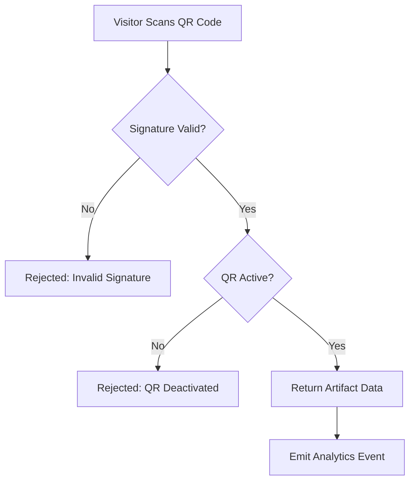

# UC-QR — QR Code System

---

## QR Scan Flow

---

## Scanning

### UC-QS01: Scan a Valid QR Code
**Actor:** Visitor (any role, including guest)  
**Precondition:** QR code is active and signature is valid.  
**Main Flow:**
1. Visitor scans a QR code beside an exhibit.
2. System verifies the HMAC signature and checks QR status.
3. Scan count is incremented; analytics event emitted.
4. Artifact data is returned to the visitor.
**Exceptions:**
- None.

---

### UC-QS02: Scan a Deactivated QR Code
**Actor:** Visitor  
**Precondition:** QR code has been deactivated by an admin.  
**Main Flow:**
1. Visitor scans a deactivated QR code.
2. System verifies signature (valid) but detects inactive status.
3. Visitor is informed the QR code is no longer active.
**Exceptions:**
- None.

---

### UC-QS03: Scan a Tampered QR Code
**Actor:** Visitor / Attacker  
**Precondition:** QR code payload has been modified.  
**Main Flow:**
1. Someone scans a QR code with a tampered or forged payload.
2. System fails HMAC signature verification.
3. Scan is rejected as invalid.
**Exceptions:**
- None.

---

### UC-QS04: Scan QR from a Different Museum
**Actor:** Visitor  
**Precondition:** Visitor scans a QR belonging to Museum B in a Museum A context.  
**Main Flow:**
1. Visitor scans a QR code from a different museum.
2. Signature validation fails (different museum context/key).
3. Scan is rejected.
**Exceptions:**
- None.

---

## Admin Management

### UC-QA01: View QR Code Details
**Actor:** Content Editor / Museum Admin  
**Precondition:** QR code exists within actor's museum.  
**Main Flow:**
1. Actor navigates to the QR management view for an artifact.
2. System displays QR image, scan count, and status.
**Exceptions:**
- None.

---

### UC-QA02: Deactivate a QR Code
**Actor:** Museum Admin  
**Precondition:** QR code is active and within actor's museum.  
**Main Flow:**
1. Museum admin deactivates a QR code.
2. Future scans of this code return a "gone" response.
**Exceptions:**
- Content editor attempts deactivation → denied (insufficient role).

---

### UC-QA03: Bulk Generate QR Codes
**Actor:** Museum Admin  
**Precondition:** Museum has artifacts without QR codes, or re-generation is needed.  
**Main Flow:**
1. Museum admin triggers bulk QR generation.
2. System queues the job and returns a job reference.
3. On completion, a downloadable ZIP of QR images is available.
**Exceptions:**
- None.

---

## Edge Cases

### UC-QE01: Scan QR Code Signed with Rotated Key
**Actor:** Visitor  
**Precondition:** QR code was physically printed using a previous HMAC secret; the secret has since been rotated.  
**Main Flow:**
1. Visitor scans a QR code signed with an older key.
2. System extracts the `kid` from the QR payload.
3. System looks up the corresponding old HMAC secret (retained in the 2-key buffer).
4. Signature validates successfully using the old key.
5. Scan proceeds normally (artifact data returned).
**Exceptions:**
- Old key has been purged (more than 2 rotations ago) → signature validation fails; scan rejected as invalid.

---

### UC-QE02: Scan QR Code of Soft-Deleted Artifact
**Actor:** Visitor  
**Precondition:** Artifact has been soft-deleted; its QR code was deactivated as a cascade.  
**Main Flow:**
1. Visitor scans a physical QR code that still exists beside the exhibit.
2. System verifies the signature (valid).
3. System detects the QR code is deactivated.
4. Visitor is informed the QR code is no longer active (`410 Gone`).
**Exceptions:**
- None.

---

### UC-QE03: QR Scan Endpoint Rate Limiting
**Actor:** Malicious Bot / Abuser  
**Precondition:** A script or abuser rapidly scans the same QR code or hammers the validation endpoint.  
**Main Flow:**
1. System detects abnormal scan frequency from a single IP or token.
2. Rate limiter throttles further requests (100 req/min public limit applies).
3. `scan_count` is only incremented for non-throttled, valid scans.
**Exceptions:**
- Distributed sources bypass IP rate limit → platform monitoring triggers alerts.

---

### UC-QE04: Bulk Generation Job Partial Failure
**Actor:** System  
**Precondition:** Bulk QR generation job is processing multiple artifacts.  
**Main Flow:**
1. Job processes artifacts sequentially or in batches.
2. Some QR codes generate successfully; others fail (e.g., S3 upload error).
3. Successful QR codes are stored; failed ones are logged.
4. Job completes with a partial success status.
5. Admin is informed which artifacts failed QR generation and can re-trigger individually.
**Exceptions:**
- None.

---

### UC-QE05: Re-Activate a Deactivated QR Code (Not Supported)
**Actor:** Museum Admin  
**Precondition:** QR code has been deactivated.  
**Main Flow:**
1. Museum admin attempts to re-activate a deactivated QR code.
2. System does not provide a reactivation endpoint (by design).
3. Admin must delete the old QR record and trigger a new QR code generation for the artifact (via artifact update or bulk generation).
**Exceptions:**
- None.

> **Note:** QR deactivation is one-way in v1.0. If reactivation becomes a frequent need, a `POST /api/v1/qr/:id/reactivate` endpoint should be considered for Phase 2.
